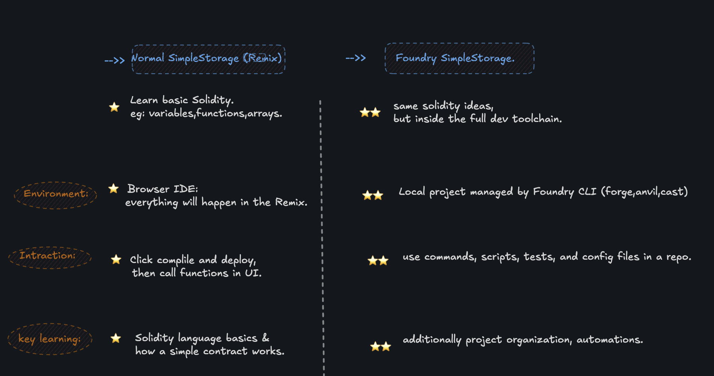

# FOUNDRY SIMPLE STORAGE (FOUNDRY)

## project ?
*  It shows how a contract can keep state: one number (myFavoriteNumber)
   stored on the blockchain that you can update and read later (store, retrieve).

* It introduces data structures in Solidity: a struct (Person), a dynamic array (listOfPeople),
    and a mapping (nameToFavoriteNumber) to connect a name to a number.

* In Foundry, the same contract is used to teach a professional workflow: proper project structure, formatting with forge fmt, README, tests, and scripts.

 